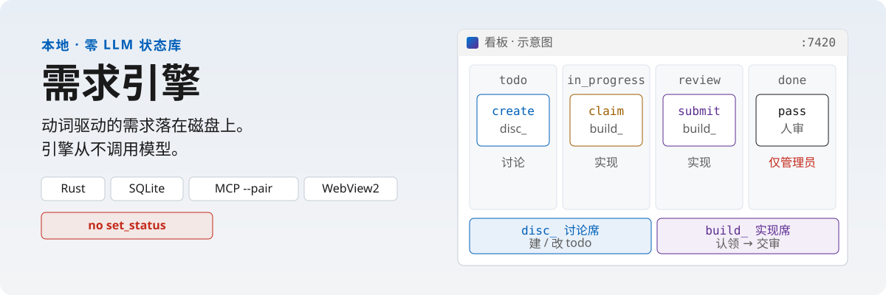
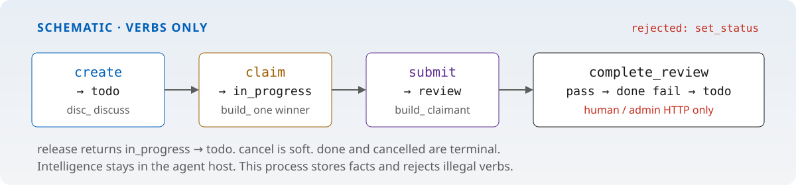

# req-engine · 需求引擎

[English](README.md) · **简体中文**

<p align="center">
  
</p>

**零 LLM、动词驱动的需求状态库。** Rust + SQLite 执行生命周期；Windows WebView2 看板给人坐；MCP 的 `disc_` / `build_` 匹配码把编码 Agent 绑到「一个项目 + 一个座位」。引擎进程**从不**调用模型。

[](req-engine/Cargo.toml)
[](LICENSE)

**给谁用。** 在本机跑编码 Agent 宿主（Cursor / Claude Desktop / Codex / Grok …），又不想让 Agent 随便改状态的人。`done` 由人拍板。

**这不是什么。** 不是 Agent 运行时、Worker 池或 IDLE 调度器。不是云端 SaaS。不是模型套壳 — 引擎内零 LLM 是契约。不是可以 `PATCH` 出一致性的自由看板。[`demo/*.html`](demo/) 是**静态稿**，不是运行时 UI。MCP `--role` + token 只是**调试后门**，不要当交付。

## 从这里开始

**官方入口是 Windows。** 需要 [Rust](https://rustup.rs) 和 [WebView2 Runtime](https://developer.microsoft.com/microsoft-edge/webview2/)（多数 Win10/11 已带）。

1. 双击 [`启动需求引擎.bat`](启动需求引擎.bat)（已有二进制时可直接用 [`启动需求引擎.vbs`](启动需求引擎.vbs)）。首次若无二进制会 `cargo build --release`，再以**隐藏控制台**启动 `desktop --home req-engine/data --port 7420`。
2. 或在终端：

```powershell
cd req-engine
cargo run -- desktop --home ./data
```

这会打开**系统窗口**（不是浏览器页），自动建空库，并注入 admin token。关窗口进托盘；只有托盘「退出」才杀进程。

3. 在看板建项目，点「复制讨论侧 / 复制实现侧」，把接入包贴到 **Agent 宿主** 的 MCP 配置里——看板本身不是 MCP Client。

```json
{
  "mcpServers": {
    "req-engine-discuss": {
      "command": "C:\\path\\to\\req-engine.exe",
      "args": ["mcp", "--pair", "disc_…", "--home", "C:\\path\\to\\req-engine\\data"]
    }
  }
}
```

宿主与桌面必须共用同一个 `--home`。模板：[`req-engine/examples/`](req-engine/examples/)。完整说明：[`req-engine/docs/MCP.md`](req-engine/docs/MCP.md)。

双击启动器固定 `req-engine/data`。不传 `--home` / `REQ_ENGINE_HOME` 时，CLI 默认是 `%USERPROFILE%\.req-engine`（Unix：`~/.req-engine`）。

<details>
<summary>可选：演示数据、仅 API、测试</summary>

```powershell
cd req-engine
cargo test
cargo build --release

# 桌面可选演示项目
cargo run -- desktop --home ./data --seed-if-missing
# 或：cargo run -- seed --home ./data

# 仅 API（不打开系统窗口）
cargo run -- init --home ./data --seed
cargo run -- serve --home ./data --host 127.0.0.1 --port 7420
```

冒烟（真 HTTP）：`req-engine/scripts/smoke.ps1`。浏览器连法：[`WEB.md`](WEB.md)（可选）。

</details>

---

## 为什么要单独做引擎

写需求和实现需求是两份工作。讨论侧 Agent 应该建/改 todo；实现侧 Agent 应该认领并交审；人决定是否 done。多数「AI 看板」把这些捏进同一个聊天框，模型还可以随便 `PATCH` 状态。

`req-engine` 反过来：**本地状态机 + 座位**。智能留在 Agent 宿主。引擎只存事实、拒绝非法动词、标出谁坐在座位上。

## 为什么动词优于 `set_status`

自由改 status 等于让工作流在提示词里漂移。两个 Agent 可以不认领就标 `done`；规划侧可以跳过审核；模型会写出 `"in-review"` 而不是 `"review"`。你最后在调 prompt，而不是在调产品。

这里的状态**不是可写字段**，而是动词的**结果**：

<p align="center">
  
</p>

| 动词 | 从 | 到 | 谁可以（HTTP） |
|------|----|----|----------------|
| 创建 | — | `todo` | admin、planner |
| `claim` 认领 | `todo` | `in_progress` | foreman、admin — 原子，只有一个赢家 |
| `report_progress` | `in_progress` / `review` | *不变* | 认领人或 admin |
| `submit_for_review` | `in_progress` | `review` | 认领人或 admin |
| `complete_review` 通过 / 驳回 | `review` | `done` / `todo` | **仅 admin**（桌面 / HTTP） |
| `release` 释放 | `in_progress` | `todo` | 认领人或 admin |
| `cancel` 取消 | 按角色 | `cancelled` | planner 仅 `todo` · admin 任意非终态 |

HTTP / MCP **都没有** `set_status` / `update_status`。`done` 与 `cancelled` 是终态。只软取消，MVP 不硬删。认领走 `BEGIN IMMEDIATE`，并带 `WHERE status = 'todo' AND claimed_by IS NULL`，两个 MCP 进程不能同时赢。

状态机在 [`req-engine/src/domain/state.rs`](req-engine/src/domain/state.rs)。服务层应用它；HTTP 与 MCP 不能绕过。

## 为什么「零 LLM」是卖点

仓库一旦会「想」，你就无法审计。引擎里的模型会发明转移、把失败写成散文、并把看板绑死在某一家 API Key 上。

本进程**不**调用 OpenAI、Anthropic 或任何模型。MCP 是宿主来连的 **Server**。Token / 匹配码是 ACL，不是「AI 密钥」。座位脸只是用宿主自报的 `clientInfo.name` 做展示（已知宿主表或色块 identicon）——**不作鉴权**。

非法转移可以纯单测：不需要 GPU、外网、也不需要提示词。

---

## 架构

```
 人 ── WebView2 看板 ── HTTP /v1（admin Bearer） ─┐
                                                 │
 讨论 Agent ── MCP stdio --pair disc_…  ─────────┼──►  req-engine
 实现 Agent ── MCP stdio --pair build_… ─────────┘         │
                                                           ▼
                                          SQLite（需求、事件、
                                          token 哈希、匹配码哈希、
                                          seat_presence 心跳）
```

| 层 | 职责 |
|----|------|
| **Domain** | 按角色的纯转移。无 I/O。 |
| **Services** | 动词 + 事件。认领带事务。 |
| **HTTP** | 本地看板 + 人审。Bearer → SHA-256 → `admin` / `planner` / `foreman`。 |
| **MCP** | 产品路径：`--pair` 绑定 **一个项目 + 一个座位**。`--role` + token 仅调试，不要当交付。 |
| **Desktop** | 拉起 API，托管 [`req-engine/web/index.html`](req-engine/web/index.html)，打开**系统窗口**（不是浏览器页）。关窗口进托盘；只有托盘「退出」才杀进程。 |

---

## 座位、匹配码、在席

每个项目两个座位：

| 座位 | 码前缀 | MCP 面 | 可以 | 不可以 |
|------|--------|--------|------|--------|
| 讨论 | `disc_` | planner | 列表 / 读取 / 创建 / 改 `todo` / 取消 `todo` | 认领、交审、下场写代码、`complete_review` |
| 实现 | `build_` | foreman | `list_ready_tasks`、认领、进度、交审、释放 | 建卡、`complete_review` |

桌面「复制讨论侧 / 复制实现侧」会把**匹配码 + 接入 Prompt** 放进剪贴板。

- 库里只存码的 **SHA-256**（`discuss_pair_hash` / `build_pair_hash`）。
- 明文在 `{home}/pair-codes.json`（已 gitignore）。轮换后旧码立刻失效。
- 入座的 MCP 进程每 **4 秒**心跳一次。UI 以 `last_seen` 是否在 **15 秒**内判断在席。进程退出（或 pid 已换）座位脸消失。

`list_ready_tasks` 只返回依赖都已 `done` 的 `todo`。

---

## HTTP（本机）

鉴权：`Authorization: Bearer <token>`。CORS 放行常见 localhost 静态源。健康检查免登录，其余需登录。

| 方法 | 路径 | 角色 |
|------|------|------|
| `GET` | `/v1/health` | 无 |
| `GET` / `POST` | `/v1/projects` | 已登录 / **admin** |
| `PATCH` | `/v1/projects/:id` | admin |
| `POST` | `/v1/projects/:id/archive` · `unarchive` | admin |
| `GET` / `POST` | `/v1/projects/:id/pair-codes` · `…/:seat/rotate` | admin |
| `POST` | `/v1/projects/:id/requirements` | admin、planner |
| `POST` | `/v1/requirements/:id/claim` · `progress` · `submit-review` · `release` | foreman、admin |
| `POST` | `/v1/requirements/:id/complete-review` | **admin** |
| `POST` | `/v1/requirements/:id/cancel` | planner、admin |

端口 **7420**。桌面会把 admin token 注入 WebView，正常路径不用手贴。

---

## 数据目录

`{home}` 内：

| 文件 | 内容 |
|------|------|
| `req-engine.sqlite` | 项目、需求、事件、token 哈希、匹配码哈希、`seat_presence` |
| `tokens.txt` | 引导用 **明文** admin/planner/foreman（仅本机） |
| `pair-codes.json` | 每项目 `disc_` / `build_` 明文 |

两份明文当密钥。根目录 [`.gitignore`](.gitignore) 已排除 `data/`、`data-*/`、`*.sqlite`、`tokens.txt`、`pair-codes.json`。

---

## 目录

| 路径 | 角色 |
|------|------|
| [`req-engine/`](req-engine/) | Crate：`init` / `serve` / `mcp` / `desktop` |
| [`req-engine/web/index.html`](req-engine/web/index.html) | **运行时**看板（走 API） |
| [`req-engine/src/domain/state.rs`](req-engine/src/domain/state.rs) | 动词状态机 |
| [`req-engine/src/mcp/`](req-engine/src/mcp/) | planner / foreman stdio（`rmcp`） |
| [`req-engine/src/services/presence.rs`](req-engine/src/services/presence.rs) | 在席 TTL |
| [`demo/`](demo/) | HTML 静稿 — 不当运行时 UI |
| [`WEB.md`](WEB.md) | 浏览器连法（可选） |

Crate 开发笔记：[`req-engine/README.md`](req-engine/README.md)。

---

## 这不是什么

- 不是 Agent 运行时、Worker 池或 IDLE 调度器
- 不是云端多租户 SaaS
- 不是模型套壳 — **引擎内零 LLM 是契约**
- 不是可以 `PATCH` 出一致性的自由看板

---

MIT。[github.com/Player-YN/req-engine](https://github.com/Player-YN/req-engine)。
